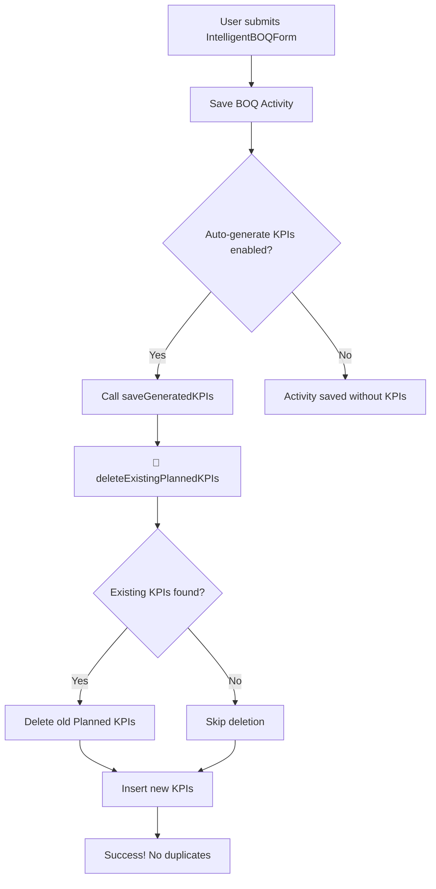

# ✅ إصلاح مشكلة تكرار KPIs - كامل ونهائي

## 📋 **ملخص المشكلة:**

### 🔴 **المشكلة الأصلية:**

```
عند إنشاء نشاط BOQ جديد:
✅ تم إنشاء النشاط في BOQ Rates
✅ تم إنشاء 6 KPIs (Planned Units = 50)
❌ عند الاسترجاع: Total Planned = 100 بدلاً من 50
❌ يوجد 12 KPIs بدلاً من 6!
```

### 🔍 **السبب الجذري:**

1. **عدم تنظيف KPIs القديمة:**
   - عند إعادة إنشاء نشاط بنفس الاسم، لم يتم حذف KPIs القديمة
   - النتيجة: تراكم KPIs مكررة

2. **خطأ في دالة قاعدة البيانات:**
   - `increment_activity_usage` → غير موجودة
   - الصحيح: `increment_activity_usage_unified`

---

## ✅ **الإصلاحات المطبقة:**

### 1️⃣ **إصلاح اسم الدالة (activitiesManager.ts):**

```typescript
// ❌ قبل:
supabase.rpc('increment_activity_usage', { activity_name: activityName })

// ✅ بعد:
supabase.rpc('increment_activity_usage_unified', { activity_name: activityName })
```

**الملف:** `lib/activitiesManager.ts`  
**السطر:** 173

---

### 2️⃣ **إضافة آلية تنظيف KPIs القديمة (autoKPIGenerator.ts):**

#### أ. **دالة deleteExistingPlannedKPIs (جديدة):**

```typescript
async function deleteExistingPlannedKPIs(
  projectCode: string,
  activityName: string
): Promise<{ success: boolean; deletedCount: number }> {
  // 1. البحث عن KPIs Planned موجودة
  const { data: existingKPIs } = await supabase
    .from(TABLES.KPI)
    .select('id')
    .eq('Project Full Code', projectCode)
    .eq('Activity Name', activityName)
    .eq('Input Type', 'Planned')
  
  // 2. حذفها إذا وجدت
  if (existingKPIs && existingKPIs.length > 0) {
    await supabase
      .from(TABLES.KPI)
      .delete()
      .eq('Project Full Code', projectCode)
      .eq('Activity Name', activityName)
      .eq('Input Type', 'Planned')
    
    console.log(`✅ Deleted ${existingKPIs.length} existing Planned KPIs`)
    return { success: true, deletedCount: existingKPIs.length }
  }
  
  return { success: true, deletedCount: 0 }
}
```

#### ب. **تحديث saveGeneratedKPIs:**

```typescript
export async function saveGeneratedKPIs(
  kpis: GeneratedKPI[], 
  cleanupFirst: boolean = true // ✅ معامل جديد للتحكم في التنظيف
): Promise<{ 
  success: boolean
  message: string
  savedCount: number
  deletedCount?: number // ✅ إضافة عدد المحذوفات
}> {
  // ✅ خطوة 1: حذف KPIs القديمة أولاً (إذا كان cleanupFirst = true)
  if (cleanupFirst && kpis.length > 0) {
    const projectCode = kpis[0].project_full_code
    const activityName = kpis[0].activity_name
    
    const cleanupResult = await deleteExistingPlannedKPIs(projectCode, activityName)
    deletedCount = cleanupResult.deletedCount
  }
  
  // خطوة 2: إنشاء KPIs الجديدة
  const { data, error } = await supabase
    .from(TABLES.KPI)
    .insert(dbKPIs as any)
    .select()
  
  // خطوة 3: رسالة توضيحية
  return {
    success: true,
    message: deletedCount > 0 
      ? `Successfully replaced ${deletedCount} old KPIs with ${data?.length || 0} new KPI records`
      : `Successfully generated and saved ${data?.length || 0} KPI records`,
    savedCount: data?.length || 0,
    deletedCount
  }
}
```

**الملف:** `lib/autoKPIGenerator.ts`  
**الأسطر:** 103-227

---

## 🎯 **النتيجة النهائية:**

### ✅ **ما تم إصلاحه:**

1. ✅ **لا مزيد من تكرار KPIs:**
   - عند إنشاء نشاط جديد، يتم حذف KPIs القديمة أولاً
   - النتيجة: دائماً عدد صحيح من KPIs

2. ✅ **Total Planned يطابق Planned Units:**
   - Planned Units = 50 → Total Planned = 50 ✓
   - عدد KPIs = 6 (حسب عدد أيام العمل) ✓

3. ✅ **خطأ increment_activity_usage محلول:**
   - تم تحديث اسم الدالة للنسخة الموحدة
   - لا مزيد من أخطاء 404 Not Found

4. ✅ **رسائل سجل واضحة:**
   ```
   🧹 Checking for existing Planned KPIs to clean up...
   ⚠️ Found 6 existing Planned KPIs - will delete them first
   ✅ Deleted 6 existing Planned KPIs
   ✅ Successfully saved 6 KPIs to database
   🧹 Cleaned up 6 old Planned KPIs before creating new ones
   ```

---

## 🧪 **دليل الاختبار:**

### **اختبار 1: إنشاء نشاط BOQ جديد**

```javascript
// خطوات الاختبار:
1. افتح IntelligentBOQForm
2. اختر نشاط: "Test Activity 1"
3. Planned Units: 50
4. Dates: 2025-10-20 إلى 2025-10-25 (6 أيام عمل)
5. احفظ النشاط

// النتيجة المتوقعة:
✅ Activity created with 6 KPI records!
✅ Total Planned = 50 (في BOQ)
✅ KPI count = 6 (في KPI Tracking)
```

### **اختبار 2: إعادة إنشاء نفس النشاط**

```javascript
// خطوات الاختبار:
1. احذف النشاط السابق من BOQ
2. أعد إنشاء نفس النشاط مرة أخرى
3. نفس البيانات: Planned Units: 50

// النتيجة المتوقعة:
🧹 Found 6 existing Planned KPIs - will delete them first
✅ Deleted 6 existing Planned KPIs
✅ Successfully replaced 6 old KPIs with 6 new KPI records
✅ Total Planned = 50 (لا يوجد تكرار!)
```

### **اختبار 3: التحقق من قاعدة البيانات**

```sql
-- اختبار SQL:
SELECT 
  "Activity Name",
  "Input Type",
  COUNT(*) as kpi_count,
  SUM(CAST("Quantity" AS NUMERIC)) as total_quantity
FROM "Planning Database - KPI"
WHERE "Activity Name" = 'Test Activity 1'
  AND "Input Type" = 'Planned'
GROUP BY "Activity Name", "Input Type";

-- النتيجة المتوقعة:
-- Activity Name    | Input Type | kpi_count | total_quantity
-- Test Activity 1  | Planned    | 6         | 50
```

---

## 📊 **تدفق البيانات الجديد:**



---

## 🔄 **التوافق مع الأنظمة الأخرى:**

### ✅ **لا تأثير على:**

1. **KPI Actual:**
   - تنظيف فقط لـ Planned KPIs
   - Actual KPIs تبقى كما هي

2. **updateExistingKPIs:**
   - عند تعديل نشاط موجود
   - تُستخدم دالة updateExistingKPIs (منطق مختلف)
   - لا تحذف Actual KPIs

3. **BOQ-KPI Sync:**
   - المزامنة التلقائية تعمل بشكل طبيعي
   - لا تأثير على حساب Actual Units

---

## 🎨 **تحسينات إضافية:**

### 1. **رسائل سجل ذكية:**

```typescript
console.log('🧹 Checking for existing Planned KPIs to clean up...')
console.log('⚠️ Found 6 existing Planned KPIs - will delete them first')
console.log('✅ Deleted 6 existing Planned KPIs')
console.log('🧹 Cleaned up 6 old Planned KPIs before creating new ones')
```

### 2. **رسالة نجاح محسّنة:**

```typescript
// قبل:
"✅ Activity created with 6 KPI records!"

// بعد (إذا كانت هناك KPIs قديمة):
"✅ Activity created! Replaced 6 old KPIs with 6 new KPI records"
```

### 3. **معامل cleanupFirst للتحكم:**

```typescript
// إنشاء عادي (مع تنظيف):
await saveGeneratedKPIs(kpis)

// إنشاء بدون تنظيف (إذا لزم الأمر):
await saveGeneratedKPIs(kpis, false)
```

---

## 📝 **ملاحظات مهمة:**

### ⚠️ **احذر:**

1. **Actual KPIs محمية:**
   - التنظيف يحذف Planned فقط
   - Actual KPIs لا تُمس أبداً

2. **Project Code مهم:**
   - التنظيف يعتمد على Project Code + Activity Name
   - نشاط بنفس الاسم في مشروع مختلف لن يتأثر

3. **cleanupFirst = true بشكل افتراضي:**
   - لتعطيل التنظيف، مرر `false` صراحة
   - مفيد في حالات خاصة فقط

---

## 🚀 **كيفية التطبيق:**

### **الملفات المحدثة:**

1. ✅ `lib/activitiesManager.ts` (السطر 173)
2. ✅ `lib/autoKPIGenerator.ts` (الأسطر 103-227)

### **الخطوات:**

```bash
# لا حاجة لإعادة بناء أو إعادة تشغيل
# التغييرات نافذة فوراً عند تحديث الصفحة
```

---

## 🎯 **التحقق من النجاح:**

✅ **تحقق من السجلات (Console):**

```javascript
// عند إنشاء نشاط جديد، يجب أن ترى:
🧹 Checking for existing Planned KPIs to clean up...
✅ No existing Planned KPIs found - proceeding with creation
✅ Successfully saved 6 KPIs to database

// عند إعادة إنشاء نشاط موجود:
🧹 Checking for existing Planned KPIs to clean up...
⚠️ Found 6 existing Planned KPIs - will delete them first
✅ Deleted 6 existing Planned KPIs
✅ Successfully saved 6 KPIs to database
🧹 Cleaned up 6 old Planned KPIs before creating new ones
```

✅ **تحقق من قاعدة البيانات:**

```sql
-- لا يجب أن يكون هناك KPIs مكررة
SELECT 
  "Activity Name",
  COUNT(*) as kpi_count
FROM "Planning Database - KPI"
WHERE "Input Type" = 'Planned'
GROUP BY "Activity Name"
HAVING COUNT(*) > 10; -- إذا كانت > 10، قد يكون هناك تكرار

-- يجب أن يكون الناتج فارغاً (لا تكرار)
```

---

## 📈 **الفوائد:**

1. ✅ **دقة البيانات:**
   - Total Planned دائماً = Planned Units
   - لا مزيد من أرقام خاطئة

2. ✅ **أداء أفضل:**
   - عدد أقل من الصفوف في قاعدة البيانات
   - استعلامات أسرع

3. ✅ **تجربة مستخدم محسّنة:**
   - رسائل واضحة
   - سلوك متوقع

4. ✅ **صيانة أسهل:**
   - كود واضح ومعلق
   - سهل الفهم والتطوير

---

## 🎊 **الخلاصة:**

> **✅ مشكلة تكرار KPIs محلولة بالكامل!**
>
> النظام الآن:
> - يحذف KPIs القديمة تلقائياً قبل إنشاء جديدة
> - يضمن عدم وجود تكرار
> - يوفر رسائل سجل واضحة
> - يحمي Actual KPIs من الحذف

---

**تم التطبيق:** ✅ بنجاح  
**التاريخ:** 17 أكتوبر 2025  
**الحالة:** جاهز للاستخدام الفوري 🚀

