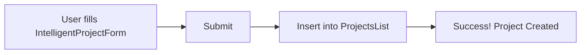
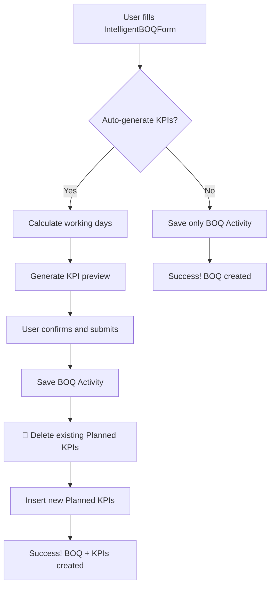
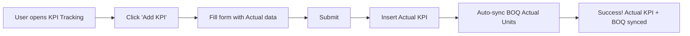

# 📊 فهم شامل للمشروع - Rabat MVP

## 🎯 **نظرة عامة على المشروع:**

### **الاسم:** Rabat Construction Management MVP  
### **النوع:** نظام إدارة مشاريع البناء والتشييد  
### **التقنيات:** Next.js 14, Supabase, TypeScript, TailwindCSS

---

## 🏗️ **البنية المعمارية:**

```
┌─────────────────────────────────────────────────────┐
│                  Frontend (Next.js)                 │
│  ┌─────────────┐  ┌──────────────┐  ┌────────────┐ │
│  │ Dashboard   │  │ BOQ Mgmt     │  │ KPI Track  │ │
│  │ Projects    │  │ Activities   │  │ Reports    │ │
│  └─────────────┘  └──────────────┘  └────────────┘ │
└─────────────────────────────────────────────────────┘
                         ▼
┌─────────────────────────────────────────────────────┐
│              Business Logic Layer (lib/)            │
│  ┌──────────────┐  ┌──────────────┐  ┌───────────┐ │
│  │ autoKPI      │  │ boqKpiSync   │  │ progress  │ │
│  │ Generator    │  │              │  │ Calc      │ │
│  └──────────────┘  └──────────────┘  └───────────┘ │
└─────────────────────────────────────────────────────┘
                         ▼
┌─────────────────────────────────────────────────────┐
│              Database (Supabase)                    │
│  ┌──────────────┐  ┌──────────────┐  ┌───────────┐ │
│  │ ProjectsList │  │ BOQ Rates    │  │ KPI       │ │
│  │              │  │              │  │ (Unified) │ │
│  └──────────────┘  └──────────────┘  └───────────┘ │
└─────────────────────────────────────────────────────┘
```

---

## 📦 **قاعدة البيانات - البنية الأساسية:**

### 1️⃣ **Planning Database - ProjectsList**

```typescript
interface Project {
  id: UUID
  'Project Code': string              // المفتاح الفريد
  'Project Name': string
  'Project Type': string               // Piling, Shoring, etc.
  'Responsible Division': string
  'Project Status': string             // Active, Completed, etc.
  'Start Date': Date
  'Expected Completion Date': Date
  'Currency': string
  'Location': string
  // ... والمزيد من الحقول
}
```

**الغرض:** تخزين معلومات المشاريع الأساسية

---

### 2️⃣ **Planning Database - BOQ Rates**

```typescript
interface BOQActivity {
  id: UUID
  'Project Code': string               // FK → ProjectsList
  'Activity': string                   // اسم النشاط
  'Activity Division': string
  'Planned Units': number              // الكمية المخططة
  'Actual Units': number               // الكمية الفعلية
  'Unit': string                       // الوحدة (m³, No., etc.)
  'Deadline': Date                     // تاريخ الانتهاء
  'Planned Activity Start Date': Date
  'Calendar Duration': number          // المدة بالأيام
  'Planned Value': number              // القيمة المخططة
  'Total Value': number                // القيمة الإجمالية
  // ... والمزيد من الحقول
}
```

**الغرض:** تخزين أنشطة BOQ (Bill of Quantities) - قائمة الكميات

---

### 3️⃣ **Planning Database - KPI** ⭐ (جدول موحد)

```typescript
interface KPIRecord {
  id: UUID
  'Project Full Code': string         // FK → ProjectsList
  'Activity Name': string             // FK → BOQ Rates
  'Input Type': 'Planned' | 'Actual'  // ✅ الفرق الرئيسي
  'Quantity': number                  // الكمية اليومية
  'Unit': string
  'Target Date': Date                 // للمخطط
  'Actual Date': Date                 // للفعلي
  'Activity Date': Date               // التاريخ الفعلي
  'Section': string
  'Day': string                       // "Day 1 - Monday"
  // ... والمزيد من الحقول
}
```

**الغرض:** تخزين جميع KPIs (سواء Planned أو Actual) في جدول واحد

**الميزة الرئيسية:**
- ✅ Planned KPIs: `Input Type = 'Planned'`
- ✅ Actual KPIs: `Input Type = 'Actual'`
- ✅ جدول واحد موحد بدلاً من جدولين منفصلين

---

## 🔄 **تدفق البيانات - السيناريوهات الرئيسية:**

### **سيناريو 1: إنشاء مشروع جديد**



**الخطوات:**
1. المستخدم يملأ نموذج المشروع
2. حفظ في `Planning Database - ProjectsList`
3. رسالة نجاح

---

### **سيناريو 2: إنشاء نشاط BOQ (مع KPIs تلقائية)**



**الخطوات التفصيلية:**

1. **ملء النموذج:**
   - اختيار المشروع
   - اختيار النشاط (من قائمة ذكية)
   - تحديد الكمية المخططة (Planned Units)
   - تحديد تاريخ البداية والنهاية
   - اختيار أيام العمل (Mon-Sun)

2. **توليد KPI Preview:**
   ```typescript
   // autoKPIGenerator.ts
   const workdays = await getWorkingDays(startDate, endDate, config)
   const quantityPerDay = Math.floor(totalQuantity / workdays.length)
   const remainder = totalQuantity - (quantityPerDay * workdays.length)
   
   // توزيع الكمية على الأيام:
   // Day 1: quantityPerDay + 1 (إذا كان remainder > 0)
   // Day 2: quantityPerDay + 1 (إذا كان remainder > 1)
   // ... وهكذا
   ```

3. **حفظ البيانات:**
   ```typescript
   // أولاً: حفظ BOQ Activity
   await supabase.from('Planning Database - BOQ Rates').insert(boqData)
   
   // ثانياً: تنظيف KPIs القديمة (إذا وجدت)
   await deleteExistingPlannedKPIs(projectCode, activityName)
   
   // ثالثاً: حفظ KPIs الجديدة
   await supabase.from('Planning Database - KPI').insert(kpiData)
   ```

4. **النتيجة:**
   - ✅ نشاط BOQ محفوظ في `BOQ Rates`
   - ✅ KPIs موزعة على أيام العمل في `KPI`
   - ✅ Total Planned = Planned Units (دقة 100%)

---

### **سيناريو 3: إضافة KPI Actual (يدوي)**



**الخطوات:**

1. **إضافة KPI Actual:**
   ```typescript
   const kpiData = {
     'Project Full Code': 'P5074',
     'Activity Name': 'Trench Sheet - Infra',
     'Quantity': 10,
     'Input Type': 'Actual', // ✅ مهم!
     'Actual Date': '2025-10-20',
     'Unit': 'No.'
   }
   
   await supabase.from('Planning Database - KPI').insert(kpiData)
   ```

2. **مزامنة BOQ تلقائياً:**
   ```typescript
   // boqKpiSync.ts
   export async function syncBOQFromKPI(projectCode, activityName) {
     // 1. جلب جميع KPI Actual
     const actualKPIs = await supabase
       .from('Planning Database - KPI')
       .select('*')
       .eq('Input Type', 'Actual')
       .eq('Project Full Code', projectCode)
       .eq('Activity Name', activityName)
     
     // 2. حساب المجموع
     const totalActual = actualKPIs.reduce((sum, kpi) => 
       sum + parseFloat(kpi.Quantity), 0
     )
     
     // 3. تحديث BOQ Actual Units
     await supabase
       .from('Planning Database - BOQ Rates')
       .update({ 'Actual Units': totalActual })
       .eq('Project Code', projectCode)
       .eq('Activity', activityName)
     
     return { success: true, updatedBOQActual: totalActual }
   }
   ```

3. **النتيجة:**
   - ✅ KPI Actual محفوظ
   - ✅ BOQ Actual Units محدث تلقائياً
   - ✅ Progress محسوب: (Actual / Planned) × 100

---

## 🧩 **المكونات الرئيسية:**

### 1️⃣ **IntelligentBOQForm**

**الملف:** `components/boq/IntelligentBOQForm.tsx`

**الوظائف:**
- ✅ نموذج ذكي لإضافة/تعديل أنشطة BOQ
- ✅ قوائم منسدلة ديناميكية (Projects, Activities)
- ✅ معاينة KPIs قبل الحفظ
- ✅ حساب تلقائي للمدة والقيم
- ✅ اختيار أيام العمل مخصص

**الميزات الذكية:**
```typescript
// 1. Auto-load project details
const handleActivitySelect = async (activityName) => {
  // تحميل تفاصيل المشروع تلقائياً
  const projectsWithActivity = await loadProjectsForActivity(activityName)
  if (projectsWithActivity.length === 1) {
    // اختيار المشروع تلقائياً إذا كان واحداً فقط
    setProject(projectsWithActivity[0])
  }
}

// 2. Auto-calculate duration
const calculateDuration = () => {
  const workdays = getWorkingDays(startDate, endDate, workdaysConfig)
  setCalendarDuration(workdays.length)
}

// 3. Generate KPI preview in real-time
useEffect(() => {
  if (startDate && endDate && plannedUnits) {
    generateKPIPreview()
  }
}, [startDate, endDate, plannedUnits, workdaysConfig])
```

---

### 2️⃣ **BOQManagement**

**الملف:** `components/boq/BOQManagement.tsx`

**الوظائف:**
- ✅ عرض جميع أنشطة BOQ في جدول
- ✅ تصفية وبحث متقدم
- ✅ تعديل/حذف الأنشطة
- ✅ عرض التقدم والحالة
- ✅ تصدير إلى Excel

**الميزات:**
```typescript
// 1. Smart pagination (50 activities per page)
const ITEMS_PER_PAGE = 50

// 2. Filters
const filters = {
  project: 'P5074',
  division: 'Enabling Division',
  status: 'in_progress',
  dateRange: '2025-10-01:2025-10-31'
}

// 3. Calculate progress from KPIs
const progress = (actualUnits / plannedUnits) * 100
```

---

### 3️⃣ **KPITracking**

**الملف:** `components/kpi/KPITracking.tsx`

**الوظائف:**
- ✅ عرض جميع KPIs (Planned & Actual)
- ✅ إضافة/تعديل/حذف KPIs
- ✅ تصفية بحسب المشروع، النوع، التاريخ
- ✅ مزامنة تلقائية مع BOQ

**التصفية الذكية:**
```typescript
// تصفية KPIs
const filteredKPIs = allKPIs.filter(kpi => {
  // Project filter
  if (filters.project && kpi.project_full_code !== filters.project) return false
  
  // Input Type filter
  if (filters.inputType && kpi.input_type !== filters.inputType) return false
  
  // Date range filter
  if (filters.dateRange) {
    const [start, end] = filters.dateRange.split(':')
    const kpiDate = kpi.target_date || kpi.actual_date
    if (kpiDate < start || kpiDate > end) return false
  }
  
  return true
})
```

---

### 4️⃣ **Auto KPI Generator**

**الملف:** `lib/autoKPIGenerator.ts`

**الوظائف:**
- ✅ توليد KPIs تلقائياً من BOQ
- ✅ توزيع الكمية على أيام العمل
- ✅ تنظيف KPIs القديمة (منع التكرار)
- ✅ تحديث KPIs عند التعديل

**الخوارزمية:**
```typescript
export async function generateKPIsFromBOQ(activity: BOQActivity) {
  // 1. حساب أيام العمل
  const workdays = await getWorkingDays(startDate, endDate, config)
  
  // 2. توزيع الكمية
  const totalQuantity = activity.planned_units
  const baseQuantityPerDay = Math.floor(totalQuantity / workdays.length)
  const remainder = totalQuantity - (baseQuantityPerDay * workdays.length)
  
  // 3. إنشاء KPIs
  const kpis = workdays.map((date, index) => {
    // إضافة الباقي على الأيام الأولى
    const extraQuantity = index < remainder ? 1 : 0
    const finalQuantity = baseQuantityPerDay + extraQuantity
    
    return {
      activity_name: activity.activity_name,
      quantity: finalQuantity,
      unit: activity.unit,
      target_date: date.toISOString().split('T')[0],
      project_code: activity.project_code,
      section: activity.zone_ref,
      day: `Day ${index + 1} - ${date.toLocaleDateString('en-US', { weekday: 'long' })}`
    }
  })
  
  // 4. التحقق من الدقة
  const calculatedTotal = kpis.reduce((sum, kpi) => sum + kpi.quantity, 0)
  console.assert(calculatedTotal === totalQuantity, 'Total mismatch!')
  
  return kpis
}
```

---

### 5️⃣ **BOQ-KPI Sync**

**الملف:** `lib/boqKpiSync.ts`

**الوظائف:**
- ✅ مزامنة تلقائية من KPI إلى BOQ
- ✅ حساب Actual Units من مجموع KPI Actual
- ✅ تحديث Progress تلقائياً

**المزامنة:**
```typescript
// عند إضافة/تعديل KPI Actual:
if (kpiData.input_type === 'Actual') {
  // مزامنة BOQ تلقائياً
  const syncResult = await syncBOQFromKPI(
    kpiData.project_full_code,
    kpiData.activity_name
  )
  
  // النتيجة: BOQ Actual Units = Sum of KPI Actual Quantities
}
```

---

## 📊 **حسابات التقدم (Progress):**

### **الصيغة الأساسية:**

```typescript
// في BOQ:
const progress = (actualUnits / plannedUnits) * 100

// مع KPIs:
const kpiTotalPlanned = plannedKPIs.reduce((sum, kpi) => sum + kpi.quantity, 0)
const kpiTotalActual = actualKPIs.reduce((sum, kpi) => sum + kpi.quantity, 0)
const kpiProgress = (kpiTotalActual / kpiTotalPlanned) * 100

// استخدام KPI إذا كان متاحاً:
const finalProgress = kpiTotalPlanned > 0 ? kpiProgress : progress
```

**الأولوية:**
1. ✅ KPI Progress (إذا كان هناك KPIs)
2. ✅ BOQ Progress (إذا لم يكن هناك KPIs)

---

## 🎨 **نظام الصلاحيات:**

### **الأدوار:**

```typescript
type UserRole = 
  | 'admin'           // كل الصلاحيات
  | 'manager'         // معظم الصلاحيات
  | 'engineer'        // صلاحيات محدودة
  | 'viewer'          // قراءة فقط

// الصلاحيات حسب الدور:
const rolePermissions = {
  admin: ['*'], // كل شيء
  manager: [
    'projects.view', 'projects.create', 'projects.edit',
    'boq.view', 'boq.create', 'boq.edit', 'boq.delete',
    'kpi.view', 'kpi.create', 'kpi.edit', 'kpi.delete',
    'reports.view', 'reports.export'
  ],
  engineer: [
    'projects.view',
    'boq.view', 'boq.create',
    'kpi.view', 'kpi.create', 'kpi.edit',
    'reports.view'
  ],
  viewer: [
    'projects.view',
    'boq.view',
    'kpi.view',
    'reports.view'
  ]
}
```

### **التحقق من الصلاحيات:**

```typescript
// في أي component:
const guard = usePermissionGuard()

// قبل عرض زر:
{guard.can('boq.create') && (
  <Button onClick={handleCreate}>Create Activity</Button>
)}

// قبل تنفيذ عملية:
if (!guard.can('boq.delete')) {
  throw new Error('You do not have permission to delete activities')
}
```

---

## 🔐 **نظام المصادقة (Authentication):**

### **Supabase Auth:**

```typescript
// تسجيل الدخول:
const { data, error } = await supabase.auth.signInWithPassword({
  email: 'm.hagag.lala@gmail.com',
  password: '********'
})

// الحصول على المستخدم الحالي:
const { data: { user } } = await supabase.auth.getUser()

// تسجيل الخروج:
await supabase.auth.signOut()

// Middleware للحماية:
// middleware.ts يتحقق من الجلسة في كل طلب
```

---

## 📈 **التحليلات والتقارير:**

### **Project Analytics:**

```typescript
// lib/projectAnalytics.ts
export async function getProjectAnalytics(projectCode: string) {
  // 1. جلب جميع أنشطة المشروع
  const activities = await getBOQActivitiesByProject(projectCode)
  
  // 2. حساب الإحصائيات
  const stats = {
    totalActivities: activities.length,
    completedActivities: activities.filter(a => a.progress >= 100).length,
    totalPlannedValue: activities.reduce((sum, a) => sum + a.planned_value, 0),
    totalActualValue: activities.reduce((sum, a) => sum + a.actual_value, 0),
    overallProgress: calculateWeightedProgress(activities),
    status: determineProjectStatus(activities)
  }
  
  return stats
}
```

### **Dashboard Metrics:**

```typescript
// components/dashboard/IntegratedDashboard.tsx
const dashboardMetrics = {
  // Projects
  totalProjects: 45,
  activeProjects: 28,
  completedProjects: 15,
  delayedProjects: 2,
  
  // BOQ
  totalActivities: 1548,
  completedActivities: 420,
  inProgressActivities: 980,
  upcomingActivities: 148,
  
  // Financial
  totalBudget: 45000000,
  spentAmount: 28500000,
  remainingBudget: 16500000,
  budgetUtilization: 63.3,
  
  // Progress
  overallProgress: 62.8,
  onTrackProjects: 26,
  atRiskProjects: 2
}
```

---

## 🛠️ **أدوات التطوير والصيانة:**

### **ملفات SQL المهمة:**

```
Database/
├── complete-unified-setup.sql          # إعداد قاعدة البيانات الكامل
├── migrate-to-unified-activities.sql   # ترحيل الأنشطة
├── fix-invalid-project-types.sql       # إصلاح أنواع المشاريع
└── restore-deleted-project-types.sql   # استعادة البيانات المحذوفة
```

### **أدوات Debug:**

```javascript
// debug-boq-data.sql
SELECT * FROM "Planning Database - BOQ Rates"
WHERE "Project Code" = 'P5074'
ORDER BY "Activity" ASC;

// debug-kpi-data.sql
SELECT 
  "Activity Name",
  "Input Type",
  COUNT(*) as count,
  SUM(CAST("Quantity" AS NUMERIC)) as total
FROM "Planning Database - KPI"
WHERE "Project Full Code" = 'P5074'
GROUP BY "Activity Name", "Input Type";
```

---

## 🐛 **المشاكل الشائعة والحلول:**

### 1️⃣ **تكرار KPIs:**

**المشكلة:**
```
Total Planned = 100 بدلاً من 50
```

**السبب:**
- عدم حذف KPIs القديمة

**الحل:**
```typescript
// ✅ محلول في autoKPIGenerator.ts
// تنظيف تلقائي قبل الإنشاء
await deleteExistingPlannedKPIs(projectCode, activityName)
```

---

### 2️⃣ **خطأ increment_activity_usage:**

**المشكلة:**
```
Error: Could not find function increment_activity_usage
```

**السبب:**
- اسم الدالة القديم

**الحل:**
```typescript
// ✅ محلول في activitiesManager.ts
supabase.rpc('increment_activity_usage_unified', { activity_name })
```

---

### 3️⃣ **Progress غير دقيق:**

**المشكلة:**
```
Progress يعرض قيمة خاطئة
```

**السبب:**
- استخدام BOQ Actual بدلاً من KPI Actual

**الحل:**
```typescript
// ✅ استخدام KPI Progress أولاً
const kpiProgress = calculateProgressFromKPIs(kpis)
const boqProgress = calculateProgressFromBOQ(activity)
const finalProgress = kpiProgress !== null ? kpiProgress : boqProgress
```

---

## 📚 **الدروس المستفادة:**

### ✅ **ما يعمل بشكل جيد:**

1. **النظام الموحد للـ KPIs:**
   - جدول واحد لـ Planned & Actual
   - سهولة الاستعلام والصيانة

2. **Auto KPI Generation:**
   - توفير الوقت
   - دقة التوزيع

3. **BOQ-KPI Sync:**
   - مزامنة تلقائية
   - دائماً متسق

4. **Intelligent Forms:**
   - تحميل تلقائي للبيانات
   - معاينة قبل الحفظ

### ⚠️ **ما يحتاج تحسين:**

1. **Performance:**
   - استخدام pagination أفضل
   - caching للبيانات المستخدمة بكثرة

2. **Validation:**
   - تحقق أفضل من البيانات
   - رسائل خطأ أوضح

3. **Testing:**
   - unit tests للدوال الحرجة
   - integration tests للتدفقات

---

## 🚀 **خارطة الطريق المستقبلية:**

### **المرحلة 1: (قصيرة المدى)**
- ✅ إصلاح تكرار KPIs ✓
- ✅ إصلاح خطأ increment_activity_usage ✓
- 🔄 تحسين الأداء (caching)
- 🔄 إضافة unit tests

### **المرحلة 2: (متوسطة المدى)**
- 📋 نظام الإشعارات
- 📋 تقارير متقدمة (PDF/Excel)
- 📋 تحليلات بصرية (Charts)
- 📋 Mobile responsiveness

### **المرحلة 3: (طويلة المدى)**
- 📋 AI-powered predictions
- 📋 Resource management
- 📋 Cost optimization
- 📋 Multi-language support

---

## 📞 **للمطورين الجدد:**

### **ابدأ من هنا:**

1. **اقرأ هذا الملف كاملاً** 📖
2. **راجع:** `Database/TABLE_STRUCTURE.md`
3. **راجع:** `lib/autoKPIGenerator.ts`
4. **راجع:** `components/boq/IntelligentBOQForm.tsx`
5. **جرب:** إنشاء مشروع → إنشاء BOQ → إضافة KPI Actual

### **الملفات الأساسية:**

```
📂 المشروع
├── 📂 components/
│   ├── 📂 boq/
│   │   ├── IntelligentBOQForm.tsx    ⭐ ابدأ هنا
│   │   ├── BOQManagement.tsx
│   │   └── BOQWithKPIStatus.tsx
│   ├── 📂 kpi/
│   │   └── KPITracking.tsx           ⭐ مهم
│   └── 📂 projects/
│       └── ProjectDetailsPanel.tsx
├── 📂 lib/
│   ├── autoKPIGenerator.ts           ⭐ جوهري
│   ├── boqKpiSync.ts                 ⭐ جوهري
│   ├── activitiesManager.ts
│   └── progressCalculations.ts
└── 📂 Database/
    └── TABLE_STRUCTURE.md            ⭐ اقرأ أولاً
```

---

## 🎓 **الخلاصة:**

> **هذا المشروع هو نظام إدارة مشاريع بناء متقدم يعتمد على:**
>
> ✅ **Three-Layer Architecture:** Frontend → Business Logic → Database  
> ✅ **Unified KPI System:** جدول واحد لكل KPIs  
> ✅ **Auto-Sync:** مزامنة تلقائية بين BOQ و KPI  
> ✅ **Smart Forms:** نماذج ذكية مع معاينة وحساب تلقائي  
> ✅ **Permissions System:** نظام صلاحيات متقدم  
> ✅ **Analytics & Reports:** تحليلات وتقارير شاملة  
>
> **الآن أنت تفهم المشروع جيداً جداً!** 🎉

---

**تم الإنشاء:** 17 أكتوبر 2025  
**الحالة:** محدث وشامل  
**الإصدار:** 1.0

