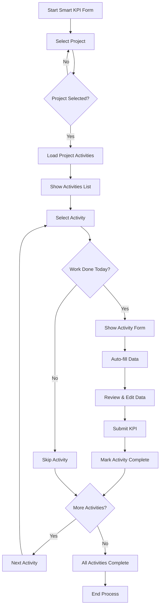
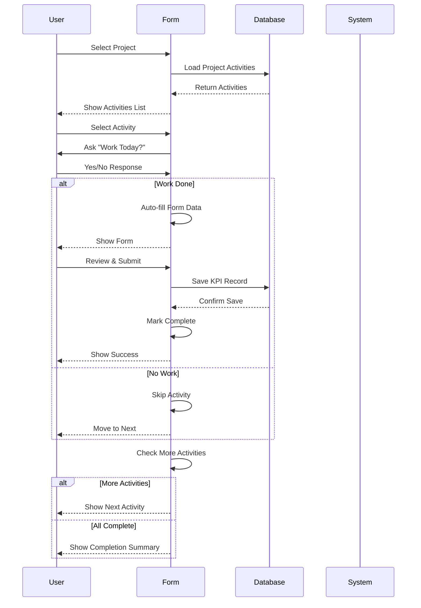

# Smart KPI Form Workflow - تدفق عمل الفورم الذكي

## Workflow Diagram | مخطط تدفق العمل



## Step-by-Step Process | العملية خطوة بخطوة

### Step 1: Project Selection | الخطوة 1: اختيار المشروع
```
User Action: Click "Start Smart KPI Form"
System Response: Show project selection interface
User Input: Search and select project
System Action: Load all activities for selected project
```

### Step 2: Activities Overview | الخطوة 2: نظرة عامة على الأنشطة
```
System Display: 
- List of all project activities
- Progress bar showing completion percentage
- Visual status indicators:
  ✅ Completed (Green)
  🔵 Current (Blue) 
  ⚪ Pending (Gray)
```

### Step 3: Activity Processing | الخطوة 3: معالجة النشاط
```
For each activity:
1. User clicks on activity
2. System shows: "Did you work on this activity today?"
3. User responds: Yes/No
4. If No: Skip to next activity
5. If Yes: Show detailed form
```

### Step 4: Smart Form | الخطوة 4: الفورم الذكي
```
Auto-filled fields:
- Unit (from activity data)
- Section (from activity division)
- Daily Quantity (from productivity rate)
- Date (today's date)

User fills:
- Actual quantity (if different from auto-filled)
- Additional notes
- Drilled meters (if applicable)
```

### Step 5: Submission | الخطوة 5: الإرسال
```
User Action: Click "Complete Activity"
System Action:
1. Validate data
2. Save KPI record
3. Mark activity as completed
4. Show success message
5. Move to next activity
```

## Data Flow | تدفق البيانات



## State Management | إدارة الحالة

### Component States | حالات المكون
```typescript
// Main workflow state
currentStep: 'project' | 'activities' | 'form'

// Project and activities
selectedProject: Project | null
projectActivities: ActivityWithStatus[]
currentActivityIndex: number

// Progress tracking
completedActivities: Set<string>
progressPercentage: number

// Form data
hasWorkToday: boolean | null
quantity: string
unit: string
actualDate: string
```

### State Transitions | انتقالات الحالة
```
project → activities: When project is selected
activities → form: When activity is selected
form → activities: When activity is completed/skipped
activities → project: When all activities are done
```

## Error Handling | معالجة الأخطاء

### Validation Rules | قواعد التحقق
```typescript
// Required fields
if (!projectCode) throw new Error('Please select a project')
if (!activityName) throw new Error('Please enter activity name')
if (!quantity || parseFloat(quantity) <= 0) throw new Error('Please enter a valid quantity')
if (!unit) throw new Error('Please enter a unit')
if (!actualDate) throw new Error('Please enter actual date')
```

### Error Recovery | استعادة الأخطاء
```
1. Network Error: Retry with exponential backoff
2. Validation Error: Show specific field error
3. Database Error: Show user-friendly message
4. Session Error: Redirect to login
```

## Performance Optimizations | تحسينات الأداء

### Lazy Loading | التحميل الكسول
```typescript
// Load data only when needed
useEffect(() => {
  if (selectedProject && activities.length > 0) {
    const projectActivities = activities
      .filter(a => a.project_code === selectedProject.project_code)
      .map(activity => ({ ...activity, isCompleted: false, hasWorkToday: false }))
    
    setProjectActivities(projectActivities)
  }
}, [selectedProject, activities])
```

### Memoization | التخزين المؤقت
```typescript
// Memoize expensive calculations
const progressPercentage = useMemo(() => {
  return Math.round((completedActivities.size / projectActivities.length) * 100)
}, [completedActivities.size, projectActivities.length])
```

## User Experience Enhancements | تحسينات تجربة المستخدم

### Visual Feedback | التغذية الراجعة البصرية
- Progress bars for completion status
- Color-coded activity states
- Loading spinners during data operations
- Success/error notifications

### Accessibility | إمكانية الوصول
- Keyboard navigation support
- Screen reader compatibility
- High contrast mode support
- Mobile-responsive design

### Performance Monitoring | مراقبة الأداء
```typescript
// Track form completion time
const startTime = Date.now()
// ... form processing ...
const completionTime = Date.now() - startTime
console.log(`Form completed in ${completionTime}ms`)
```

---

**This workflow ensures a smooth, intuitive experience for civil engineers recording site activities efficiently and accurately.**

*Smart KPI Form Workflow - Optimized for Civil Engineering Site Activity Recording*
